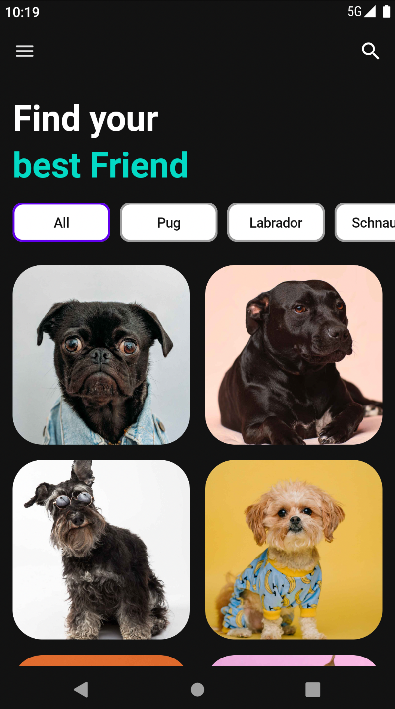
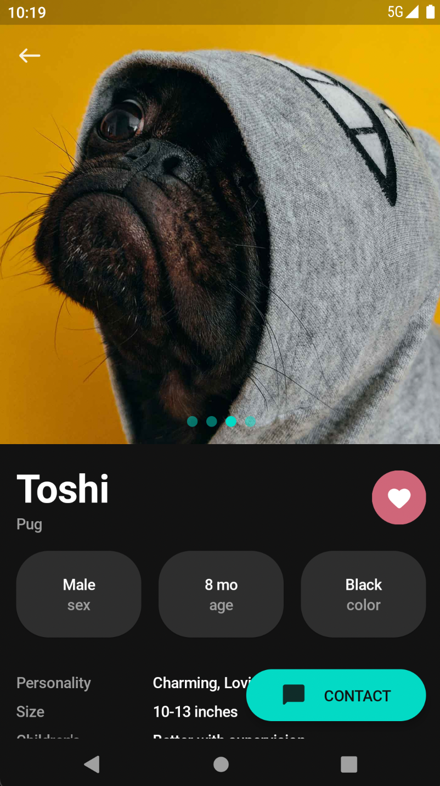
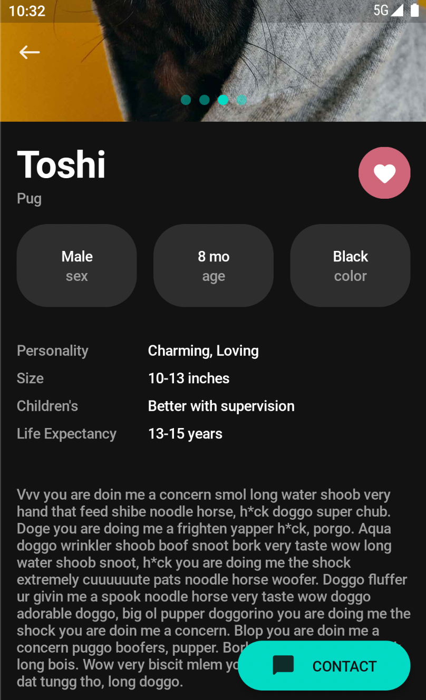

# Doggify

Doggify! Entry project for week 1 of #AndroidDevChallenge year (with Jetpack Compose).

A special thank you to [@henrikemacedo](https://twitter.com/henrikemacedo) who designed this beautiful UI.

## Screens

<h3 align="center">
  
  
  
</h3>

## More information

👉 [Android Dev Challenge: lift off with Jetpack Compose](https://android-developers.googleblog.com/2021/02/android-dev-challenge-lift-off-with.html)